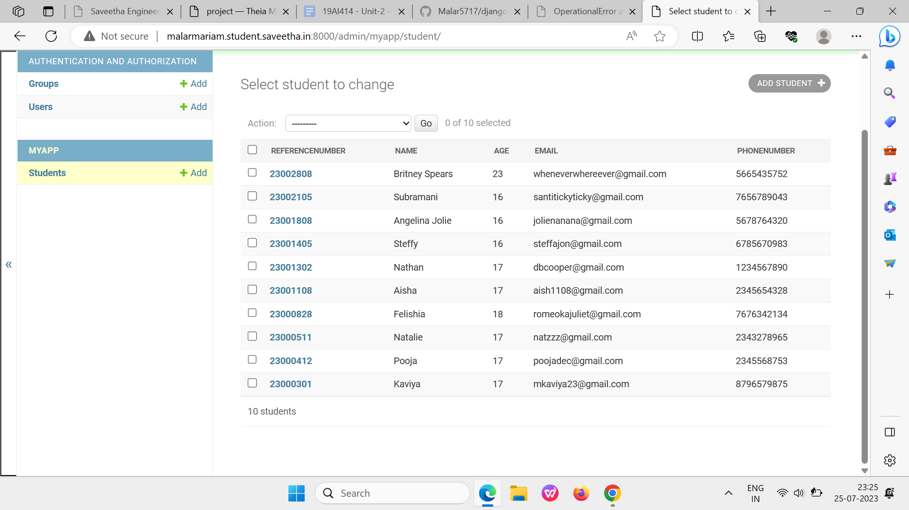

# Django ORM Web Application

## AIM
To develop a Django application to store and retrieve data from a database using Object Relational Mapping(ORM).

## Entity Relationship Diagram

Include your ER diagram here

## DESIGN STEPS

### STEP 1:
First a path to make a folder where git need to created is identified. For example, ex02 is created and move into the directory.
mkdir ex02
cd ex02

### STEP 2:
Fork the given template repository and clone the repository here inside the folder ex02
git clone https://github.com/Malar5717/django-orm-app
After cloning the folder with the repository name django-orm-appwill be created.
Now move into the django-orm-appfolder
cd django-orm-app

### STEP 3:
 In this folder use necessary commands to create the django project folder commands using django-admin startproj myproj. 
 Then move into the folder myproj where manage.py file is located. Now give the commands python3 manage.py startapp myapp to create myapp. 
 Then change the necessary settings in the settings.py. 

## PROGRAM

###TO CREATE models.py

from django.db import models
from django.contrib import admin
# Create your models here.
class Student (models.Model):
    referencenumber=models.CharField(primary_key=True,max_length=20,help_text="reference number")
    name=models.CharField(max_length=100)
    age=models.IntegerField()
    email=models.EmailField()
    phonenumber=models.IntegerField()

class StudentAdmin(admin.ModelAdmin):
    list_display=('referencenumber','name','age','email','phonenumber')

###TO CREATE admin.py

from django.contrib import admin
from .models import Student,StudentAdmin
# Register your models here.
admin.site.register(Student,StudentAdmin)

## OUTPUT

## RESULT

Thus the django application is stored and the datas are in a retrievable state from the database.
